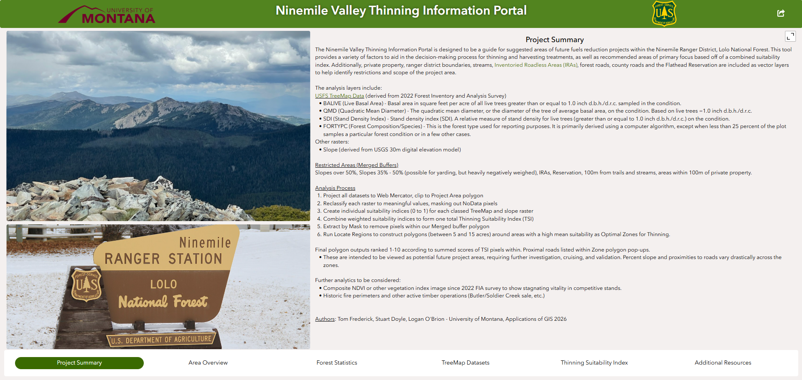
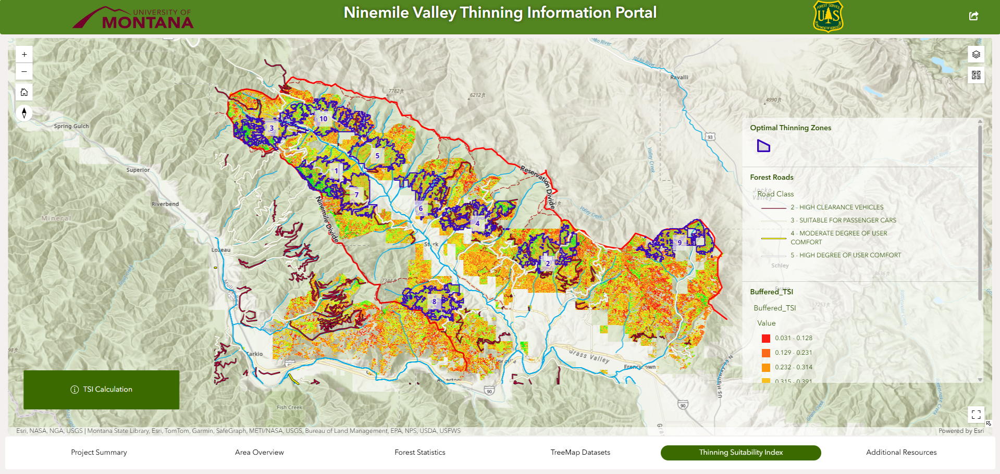

# Thinning Decision Support Tool (Experience Builder)

## Project Overview
This project is an ArcGIS Experience Builder application designed to support forest thinning and harvesting decisions in the Ninemile Valley, Lolo National Forest. The tool integrates spatial data, analysis outputs, and reference materials into a single interface to help foresters identify suitable areas for management while minimizing environmental impacts.

## Objective
To develop an interactive GIS application that helps users evaluate forest conditions, access constraints, and environmental limitations when planning thinning operations.

## My Role
- Created spatial buffers for streams, trails, private lands, and Inventoried Roadless Areas
- Implemented multiple buffer strategies for stream protection
- Contributed to raster-based analysis inputs
- Applied the Locate Regions tool to identify and rank optimal thinning areas

## Methods

### Model Considerations

- Environmental buffers were used to avoid sensitive areas (streams, private land, IRAs)
- Slope and forest structure influenced operational feasibility
- Weighted raster overlay allowed prioritization of optimal thinning zones
  
### Data Integration
- Incorporated roads, streams, parcels, DEM, and forest structure data
- Used USFS TreeMap rasters for stand characteristics (DBH, basal area, forest type)

### Spatial Analysis
- Generated buffers to restrict unsuitable areas
- Performed slope analysis from DEM
- Reclassified raster layers into suitability indices
- Combined layers into a **Thinning Suitability Index (TSI)** using weighted analysis

### Final Output
- Identified and ranked optimal thinning locations using spatial modeling
- Integrated results into an interactive Experience Builder application

## Tools Used
- ArcGIS Pro (raster analysis, modeling)
- ArcGIS Online
- ArcGIS Experience Builder

## Skills Demonstrated
- Raster-based suitability modeling  
- Buffer and constraint analysis  
- Spatial decision support design  
- Web GIS application development  
- Forestry data integration  

## Application Preview

## Live Application
🔗 [Open Experience Builder App](https://experience.arcgis.com/experience/16ba869012af4568ae88d9f7b9207995/page/Page?views=Thinning-Suitability-Index)
