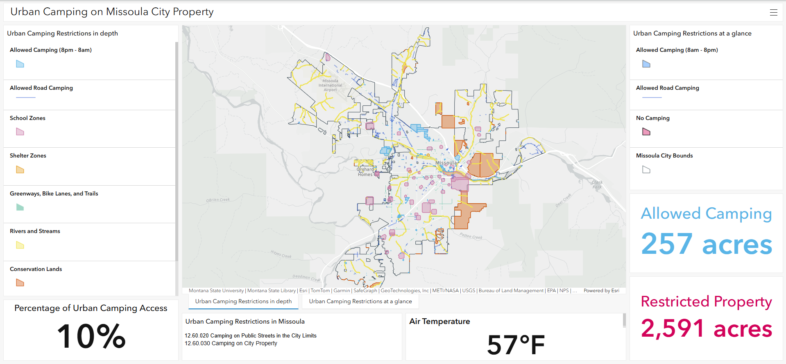

# Urban Camping Legality Dashboard

## Project Overview
This ArcGIS Online dashboard displays urban camping regulations based on Missoula, Montana's policies. 

## Problem Statement
Urban camping regulations are often written in legal language that is difficult to interpret or visualize. This project converts policy text into mapped buffer zones and restriction layers to improve clarity and public understanding.

## Methods
- Created buffer zones (50 ft, 100 ft, 300 ft) around restricted features
- Used spatial overlay (intersect/erase) to determine restricted areas
- Calculated percent of city-owned land eligible for camping

## Tools Used
- ArcGIS Pro
- ArcGIS Online
- ArcGIS Dashboards
- Spatial Overlay Analysis
- Buffer Analysis

## Skills Demonstrated
- Policy-to-spatial translation
- Buffer and overlay analysis
- Attribute calculation
- Dashboard design
- Data visualization for public communication

## Dashboard Preview

## Live Application
(Add AGOL link here)
