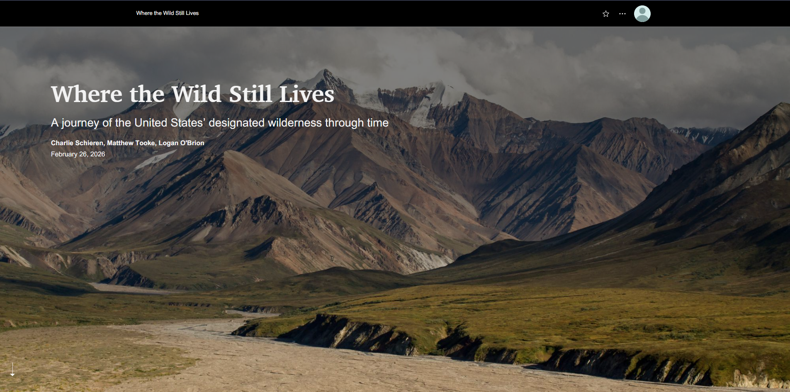
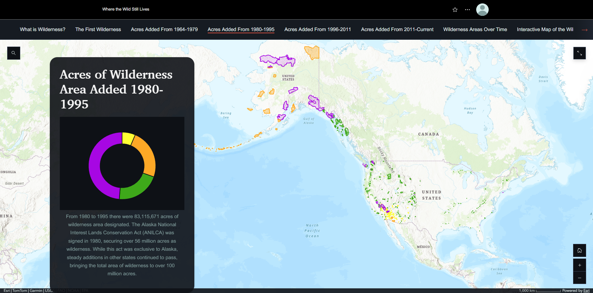

# Journey of U.S. Designated Wilderness Through Time

## Project Overview
This project is an ArcGIS StoryMap that explores the spatial and temporal evolution of designated wilderness areas in the United States. It combines maps, narrative text, and visualizations to illustrate how wilderness protection has expanded over time.

## Objective
To communicate the growth and distribution of U.S. wilderness areas through time using an interactive, narrative-driven GIS application.

## Methods

- Compiled wilderness designation data by year
- Organized temporal data for visualization
- Created web maps showing wilderness expansion
- Integrated maps into ArcGIS StoryMaps
- Designed narrative structure to guide user through time

## Tools Used
- ArcGIS Online
- ArcGIS StoryMaps
- Web Map configuration

## Skills Demonstrated
- Spatial storytelling
- Temporal data visualization
- Web GIS design
- Data organization and presentation
- Cartographic communication

## StoryMap Preview
 

## Live StoryMap
(Add link here)
